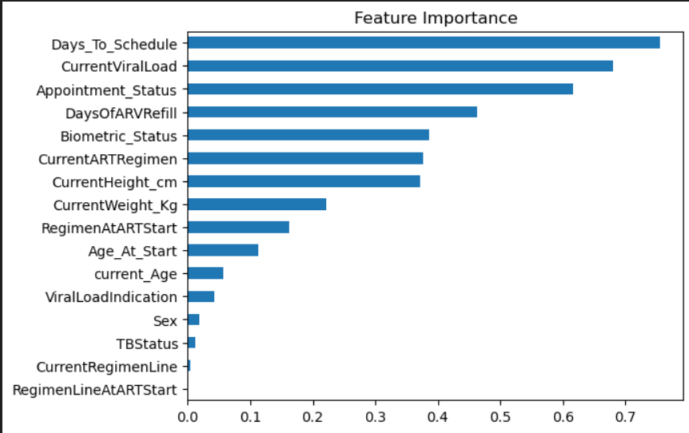

# 🎯 ART Status Prediction Analysis

Welcome to the **ART Status Prediction Analysis** repository! This project involves exploratory data analysis, data cleaning, model fitting, prediction, accuracy evaluation, and interpretation.

## 📚 Notebooks

- 📊 **[Exploratory Data Analysis & Data Cleaning](https://github.com/victorsomadina/ART-Status-Intake-Prediction-Analysis/blob/main/ART%20prediction-Data%20Exploration.ipynb))**: Dive into the data exploration and cleaning process.
- 🤖 **[Model Fitting, Prediction, Accuracy & Interpretation](https://github.com/victorsomadina/ART-Status-Intake-Prediction-Analysis/blob/main/ART%20prediction%20-%20Model%20Building.ipynb))**: Explore the model building and evaluation process.

---

## 📈 Visualizations

### 🔗 Relationship Between Variables

### 🎯 Understanding Distribution of Target Variable

### 🌟 Understanding Feature Importance

---
## 📊 Best Model Prediction Accuracy and Confusion Matrix

---

 🚀

 ### A snapshot of the Web App Interface
 

 -- Thanks for Reading 🚀

 
